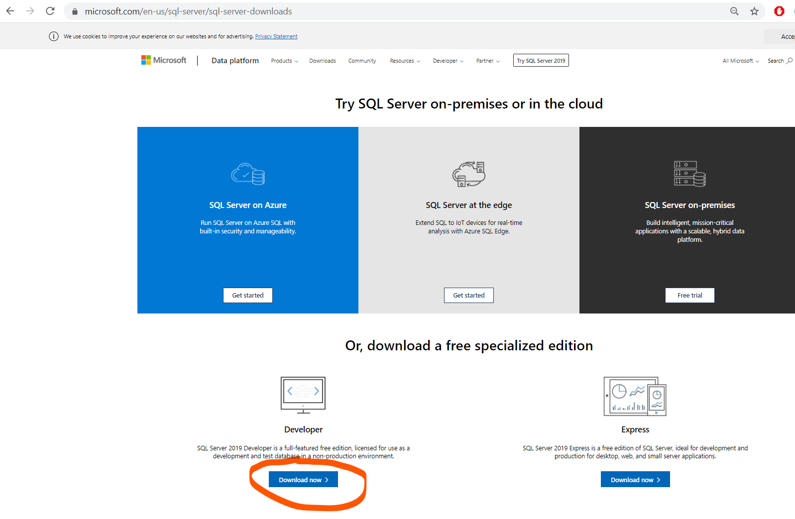
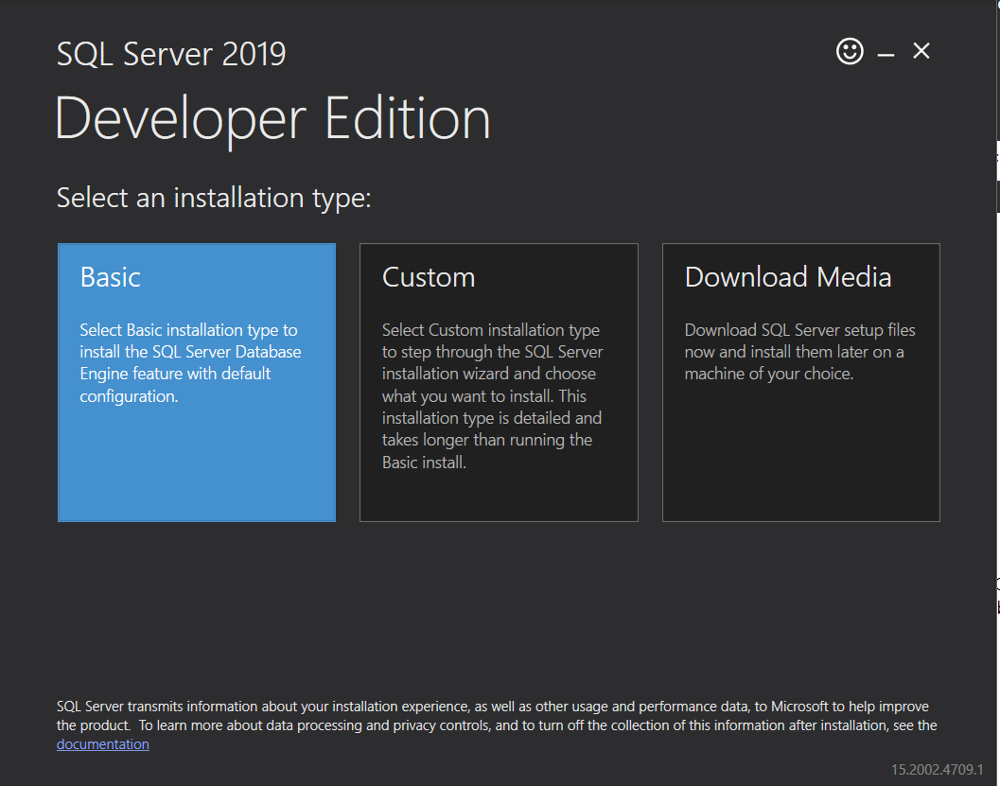
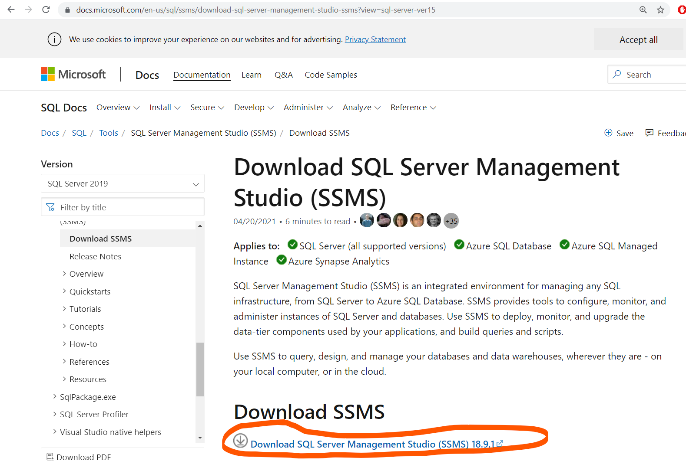
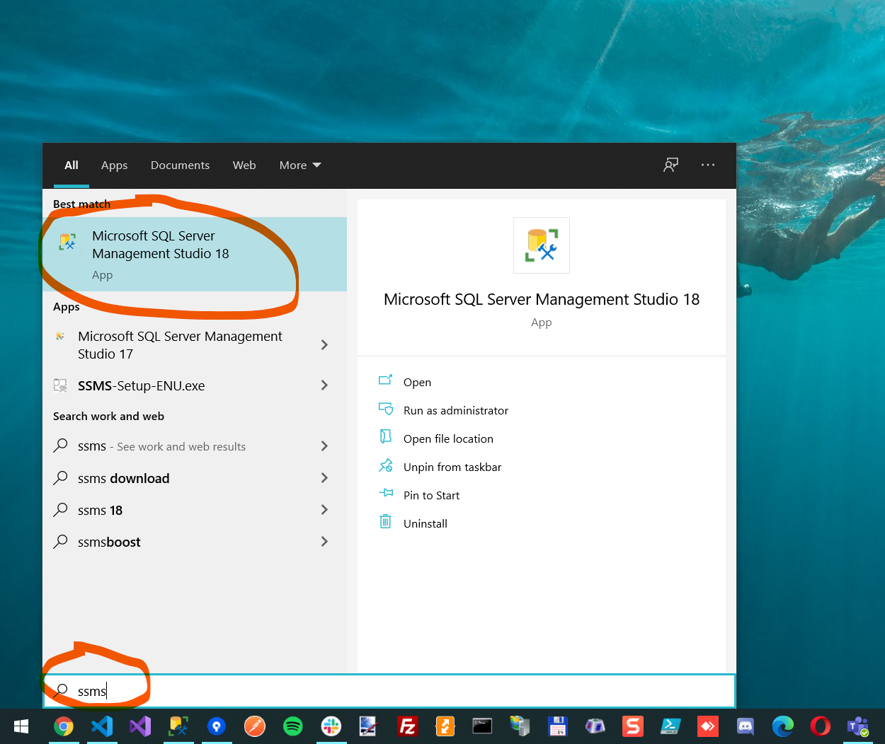
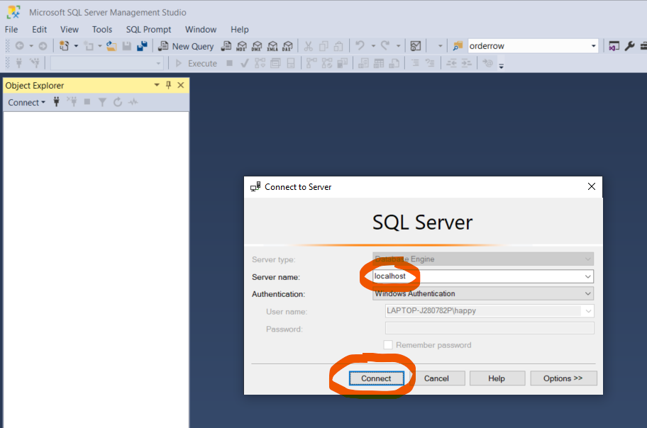
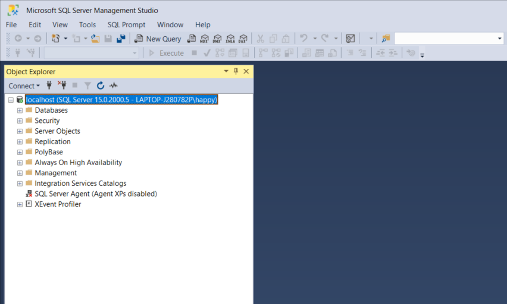

# SQL Server 2019 Developer

Download and install SQL Server 2019 Developer using the following link 

https://www.microsoft.com/en-us/sql-server/sql-server-downloads 

In the installation wizard, choose **Basic**. Then just press next, next, next... 

...finally close the window

# SQL Server Management Studio

Download and install SQL Server Management Studio using the following link (18.12.1)

https://docs.microsoft.com/en-us/sql/ssms/download-sql-server-management-studio-ssms

# Try it out

Open SQL Server Management Studio by pressing the Window Button and write **ssms**

Write **localhost** as Server name and then press Connect:

If it works it should look something like this:

# Troubleshoot

These links have solved installations problems for previous students

Error message:

    A previous installation required a reboot of the machine for changes to take effect. To proceed, restart your computer and then run Setup again.

## Solution 1

It basically requires cleaning the value of PendingFileRenameOperations (replacing the multi-string value with an empty string) under the registry ke
y

    Computer\HKEY_LOCAL_MACHINE\SYSTEM\CurrentControlSet\Control\Session Manager

https://stackoverflow.com/questions/62261436/how-to-fix-endless-reboot-loop-installing-microsoft-odbc-driver-17-message-a

## Solution 2

Uninstall Microsoft ODBC Driver 17 for SQL Server

Reboot the machine

Install SQL Server 2019

https://nolongerset.com/working-around-the-reboot-required-error-when-installing-sql-server/
