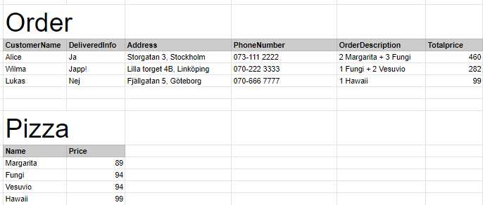

# Online Pizza

We're going to build a database for **one** pizzeria that delivers pizzas. Here is what the database should store:

    Alice orders 2 Margaritas and 3 Fungi
    Wilma orders 1 Fungi och 2 Vesuvio
    Lukas orders 1 Hawaii

    Alice lives at Storgatan 3 in Stockholm. Phone number 073-111 2222.
    Wilma lives at Lilla torget 4B in Linköping. Phone number 070-222 3333.
    Lukas lives at Fjällgatan 5 in Göteborg. Phone number 070-666 7777

    The price for Margarita is 89kr
    The price for Fungi is 94
    The price for Vesuvio is 94
    The price for Hawaii is 99

    Alice and Wilmas pizza's are delivered. 
    Lukas hasn't got his order yet.

## First attempt

This solution isn't good, but it's a start

## Problems with the previous solution

- If Alice orders again we need to reapeat her address and phonenumber
- Many people might have the name Alice
- DeliveredInfo: different ways to write yes and no
- Address: contains many values. Hard to search. We might spell the city wrong
- OrderDescription: contains many values. Hard to search and extract information (e.g how many ordered Fungi). Might spell the name of the pizzas wrong.
- Totalprice: might calculate the wrong amount
- Pizza: if two pizzas have the same name, how should we separate them?

## Step 1

Create a spreadsheet using in Google Spreadsheet for the scenario

## Step 2

Create a database named **OnlinePizzaSingle** for the scenario. The database should contain

* Tables
* Primary keys
* Foreign keys
* Data

Query all tables, using "SELECT"

## Details

https://order.openpos.tech/minimac/